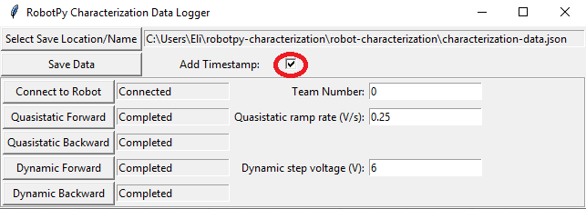

# Robot Characterization Toolsuite

This is a toolsuite for characterization of FRC robot mechanisms.  The characterization tools consist of a python application that runs on the user's PC, and matching robot code that runs on the user's robot.  The PC application will send control signals to the robot over network tables, while the robot sends data back to the application.  The application then processes the data and determines  characterization parameters for the user's robot mechanism, as well as producing diagnostic plots.  Data can be saved (in JSON format) for future use, if desired.

## Included Characterization Tools

The robot characterization toolsuite currently supports chracterization for:

- Drivetrains
- Arms
- Elevators

Feature requests for additional characterization tools are welcome.  Also note that many mechanisms can be characterized by simply adapting the existing code in this library.

## Prerequisites (PC)

To use the Robotpy Characterization Toolsuite, you must have Python (3.6 or higher) installed on your computer, as well as the standard WPILib tools for uploading a robot project:

* https://www.python.org/downloads/
* https://wpilib.screenstepslive.com/s/4485

## Installing and launching the toolsuite

To install the Robotpy Characterization Toolsuite, open a console and enter the following command:

`pip install robotpy-characterization`

The toolsuite, and all of its dependencies, should be automatically downloaded and installed.  If you are using a windows machine and the command `pip` is not recognized, ensure that [your python scripts folder has been added to the PATH](https://datatofish.com/add-python-to-windows-path/).

Once the toolsuite has been installed, launch a new drive characterization project to ensure that it works:

'robotpy-characterization drive new'

The new project GUI should open momentarily.  To launch other characterization projects, simply replace `drive` with the desired characterization type.

While the new project GUI has buttons for launching both the logging tool and the analyzer tool, these can also be launched directly from the CLI by replacing `new` with `logger` or `analyzer`.

For more information on CLI usage, enter `robotpy-characterization -h`.

## Using the toolsuite

### Generating a project

To use the toolsuite, we first need to generate a robot project.

#### Select project location

First, select the desired project location on the new project GUI:

#### Select project type

Next, select your project type from the drop-down menu:

* 'Simple' projects use encoders plugged into the RIO's DIO ports, and measure voltage with the PDP.
* 'Talon' projects use encoders plugged into a Talon SRX, and measure voltage with the Talon.
* More project types may be added in the future.

#### Configure project parameters

In order to run on your robot, the tool must know some parameters about how your robot is set up.  Project config settings are formatted as a [Python dictionary literal](https://www.linuxtopia.org/online_books/programming_books/python_programming/python_ch15s02.html).  These can be modified via the in-window config editor:

Take care of the following caveats when entering your robot specifications:

* The key names *must not be changed*, as they are hard-coded for each project type.  Only the values (i.e. the things on the right-hand side of the colons) should be modified.
* `True` and `False` *must* be capitalized, as they are evaluated as native Python.
* All string values (e.g. controller names and unit types) *must* be wrapped in quotes and *must* correspond exactly to one of the options described.
* All list values *must* be lists, even if they have only one element.  Do *not* omit trailing commas (e.g. in `(False,)`), as this will cause them not to be parsed as a list.

Once your robot configuration is set, you may save it to a location/name of your choice:

Accordingly, you can also load an existing config file (config files are project-type-specific!):

#### Enter neam number

Be sure to enter your team number in the team number field:

This is crucial to ensure your project will deploy to your robot successfully.  Note that the default team number of `0` corresponds to a localhost project, which will run locally using the WPILib robot simulator - this can be useful for ensuring that you have not made an error in your config file that results in code that does not build.

#### Generate project

Once your project has been configured, it's time to generate a deployable robot project to run the characterization:

A generated robot project will be placed in a subfolder (named `characterization-project`) of your specified project location.

The generated robot code will be in Java, and will reflect the settings specified in your config file.  Advanced users are free to modify the generated code to their liking, if the existing configuration options do not suffice.

### Deploying a project

Once a project has been generated, it is time to deploy it to the robot.  This can be done in two ways:

#### Option 1: Use the `Deploy Project` button

Pressing the `Deploy Project` button on the GUI will attempt to use GradleRIO to deploy the project to your robot.  The GUI will *always* assume that the project is located in the `characterization-project` subfolder of the chosen project location.

Assuming a valid robot project is present at that location, a window should pop up displaying the Gradle output as the project builds and deploys:

#### Option 2: Deploy manually

Since the generated project is a standard GradleRIO Java project, it can be deployed like any other.  Users may open the generated project in their editor of choice and deploy as they normally would any other robot project.  This can be convenient if customization of the generated code is required.

### Running the characterization routine

Once the characterization code has been deployed, we can now run the characterization routine, and record the resulting data for analysis.

NOTE:  Ensure you have sufficient space around the robot before running any characterization routine!  The drive characterization requires *at least* 10' of space, ideally closer to 20'.  The robot drive can *not* be accurately characterized while on blocks.

#### Launch the data logger

To launch the data logger, press the `Launch Data Logger` button:

This should open the data logger GUI:

#### Connect to robot

Next, we must connect to the robot.  Press the `Connect to Robot` button.  The status indicated next to the button should change to `Connecting...` while the tool attempts to connect to the robot's NetworkTables server.

If the tool does not seem to be successfully connecting, try rebooting the robot.  Eventually, the status should change to `Connected`, indicating the tool is successfully communicating with the robot:

#### Run tests

A standard motor characterization routine consists of two types of tests:

* Quasistatic: In this test, the mechanism is gradually sped-up such that the voltage corresponding to acceleration is negligible (hence, "as if static").
* Dynamic: In this test, a constant 'step voltage' is given to the mechanism, so that the behavior while accelerating can be determined.

Each test type is run both forwards and backwards, for four tests in total, corresponding to the four buttons:

The tests can be run in any order, but running a "backwards" test directly after a "forwards" test is generally adviseable (as it will more or less reset the mechanism to its original position).

Follow the instructions in the pop-up windows after pressing each test button:

After all four tests have been completed, the `save` button will become activated:

This will save the data as a JSON file with the specified location/name.  A timestamp will be appended to the chosen filename if the "add timestamp" button is checked:

Contributing new changes
------------------------

This is intended to be a project that all members of the FIRST community can
quickly and easily contribute to. If you find a bug, or have an idea that you
think others can use:

1. [Fork this git repository](https://github.com/robotpy/robot-characterization/fork) to your github account
2. Create your feature branch (`git checkout -b my-new-feature`)
3. Commit your changes (`git commit -am 'Add some feature'`)
4. Push to the branch (`git push -u origin my-new-feature`)
5. Create new Pull Request on github

License
-------

All code in this repository is available under the Apache v2 license.

Authors
-------

Dustin Spicuzza (dustin@virtualroadside.com)

Eli Barnett (emichaelbarnett@gmail.com)